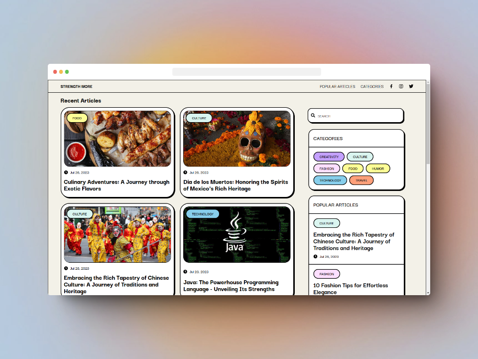

## STRENGTH MORE

  

This project is a headless Content Management System (CMS) blog website built using modern web technologies, including React, Tailwind CSS, and GraphQL. It focuses on providing a seamless and dynamic front-end experience, while the content and data management are handled through a headless CMS platform.

You can check the website at [here](https://strength-more-blog-website-project.vercel.app/)

### Features

1. **Front-end Focused**: The primary focus of the project is to create a robust and user-friendly front-end interface for blog content presentation and interaction.

2. **Headless Architecture**: The website follows a headless CMS approach, meaning the front-end and back-end are decoupled. It consumes data via GraphQL queries from a headless CMS.

3. **Dynamic Content Rendering**: Blog posts and data are dynamically fetched and rendered on the website using GraphQL queries, allowing for real-time updates and smooth content delivery.

4. **Responsive Design**: The website ensures a responsive layout, making it accessible and user-friendly across various devices.

5. **Blog Post Display**: Display blog posts with a clean and visually appealing design, providing options for categorization and tag-based filtering.

### Technologies

- [React](https://react.dev/)
- [Tailiwind CSS](https://tailwindcss.com/)
- [GraphQL](https://graphql.org/)
- [Hygraph](https://hygraph.com/)
